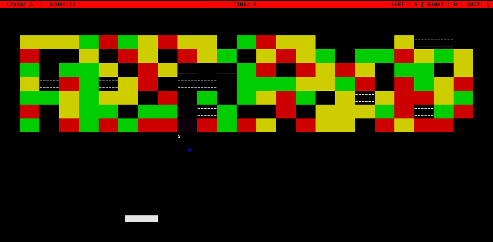

# Break-it

This game is a terminal version of DX-Ball. 

## Rules

**a** - To move left

**d** - To move right

**q** - To quit

**space**- To release ball

## Features

* Initially, the ball would appear randomly on any part of the paddle. The player can move and release the
ball at their will.
* Bricks have different colors to indicate their strength.
    * Red > Yellow > Green
  * Bricks with more strength Bricks with more strength require more hits to make them disappear.
  * With decrease in the strength of a brick due to hits from the ball, the color of the brick must change
  accordingly.
  * Unbreakable bricks which are black, cannot be broken by the ball.
* Power-ups last for 5 seconds each.
  * They appear as catch-able objects randomly on destroying a brick.
  * The power-up is activated on catching it with the paddle.
  * Expand paddle (e)
    * Increases the size of the paddle by a certain amount.
  * Shrink paddle (s)
    * Reduce the size of the paddle by a certain amount.
  * Double trouble (d)
    * Each of the balls which are present will be further divided into two.
    * If a ball is lost, the other ball will be divided into two.
    * A life is lost only if both the balls are lost.
  * Fast ball (f)
    * Increases the speed of the ball.
  * Thru ball (t)
    * Allows the ball to destroy any brick in its way including the unbreakable brick.
  * Paddle grab (g)
    * The paddle can grab the ball on contact and relaunch the ball at will.
    * The ball will follow the same expected trajectory after release, similar to the movement expected without the grab.
* Collecting a power-up which is already active, increases its time limit by 5 seconds.
* Lives, score and time played will be displayed at top of the screen.
